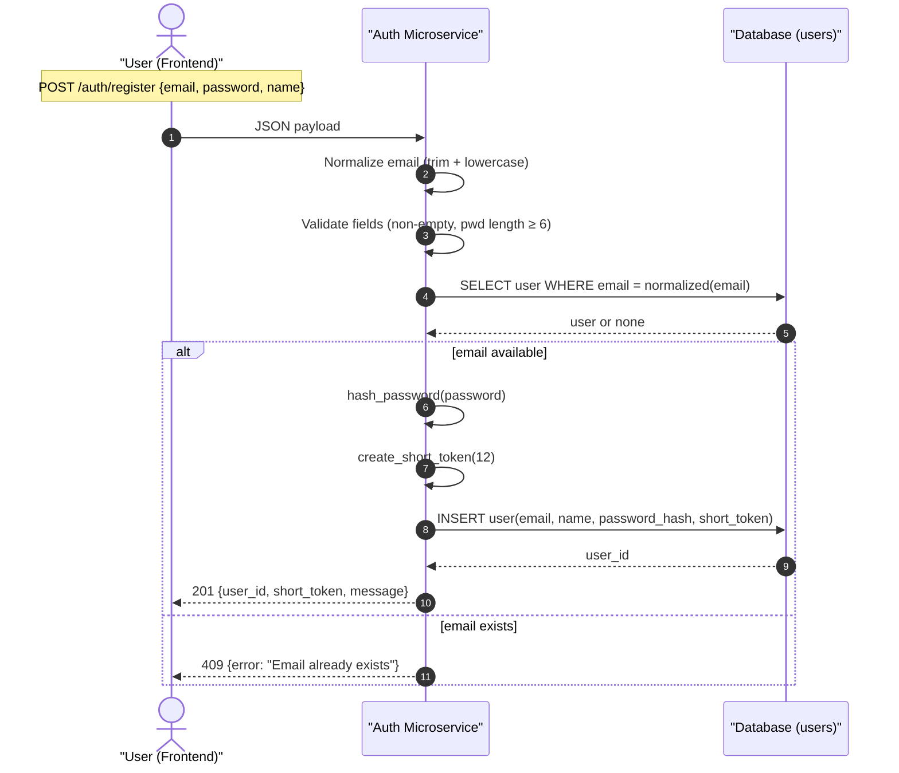
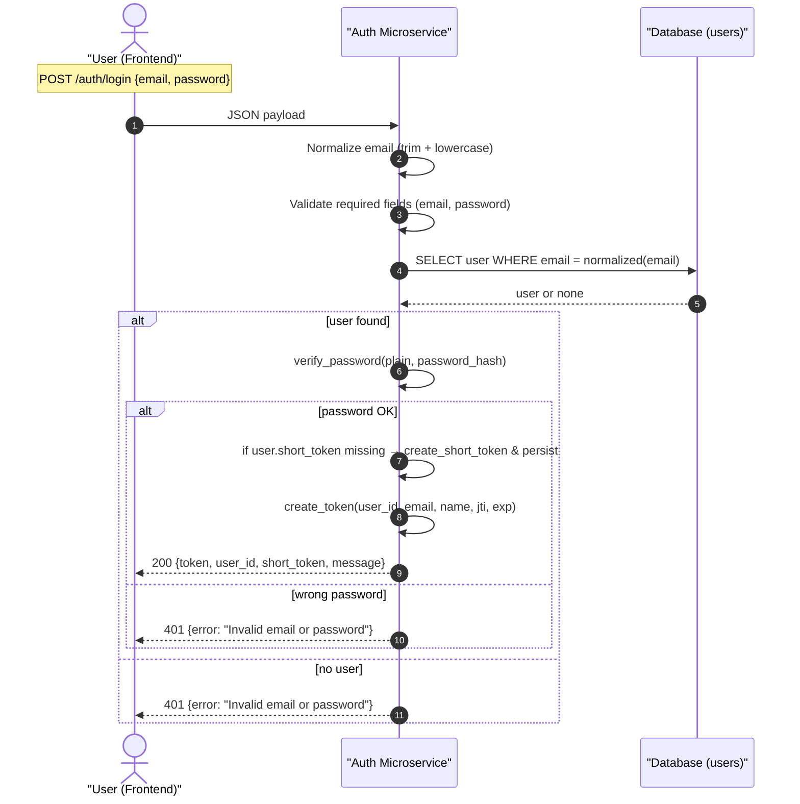

# User Authentication Microservice

Microservice Communication Contract

## Quick Start

```bash
python auth_app.py
```
Service runs on `http://localhost:5001`.

## Implementation Status

- **GET /health** — IMPLEMENTED
- **POST /auth/register** — IMPLEMENTED
- **POST /auth/login** — IMPLEMENTED
- **GET /auth/verify** — IMPLEMENTED (JWT + revocation check)
- **POST /auth/logout** — IMPLEMENTED (JWT jti blacklist + prune)
- **GET /auth/exists** — IMPLEMENTED (email availability; normalization)
- **GET /auth/user-by-short/:short_token** — IMPLEMENTED
- **POST /auth/delete-account** — IMPLEMENTED (revokes token + deletes user)

## Setup

```bash
git clone https://github.com/looking-sharp/User_Authentication_Microservice.git
cd User_Authentication_Microservice
python -m venv venv
python -m pip install -r requirements.txt
cp .env.example .env   # then edit JWT_SECRET etc.
python auth_app.py
```

---

## UML Diagrams (Register, Login, Logout)

### Register User Flow


### Login Flow


### Logout Flow
```mermaid
sequenceDiagram
    autonumber
    actor U as "User (Frontend)"
    participant A as "Auth Microservice"
    participant BL as "Blacklist (blacklisted_tokens)"
    Note over U: POST /auth/logout (Authorization: Bearer &lt;JWT&gt;)

    U->>A: Logout request + JWT
    A->>A: decode_token(JWT) -> {jti, exp}
    A->>A: _prune_blacklist() (delete expired rows)
    A->>BL: SELECT by jti
    BL-->>A: found or not found
    alt not found
        A->>BL: INSERT (jti, expires_at = exp)
        A-->>U: 200 {message: "Logout successful"}
    else already present
        A-->>U: 200 {message: "Already logged out"}
    end
```

---

## ENDPOINTS

### Health (IMPLEMENTED)

**Endpoint:** `GET /health`  
Returns simple status for container health checks.

---

### Register (IMPLEMENTED)

**POST /auth/register**

Creates a new user after validating:
- required fields present  
- password ≥ 6 chars  
- email unique  
- email normalized (lowercase + trimmed)  

Returns `201 Created` or `409 Conflict`.

---

### Login (IMPLEMENTED)

**POST /auth/login**

Validates credentials, issues:
- JWT  
- short_token (persisted if missing)  

Returns `200 OK` or `401 Unauthorized`.

---

### Verify (IMPLEMENTED)

**GET /auth/verify**

Enforces:
- valid JWT  
- signature + expiration  
- blacklist revocation  

Returns `200 OK` or `401 Unauthorized`.

---

### Logout (IMPLEMENTED)

**POST /auth/logout**

Revokes JWT by storing its `jti` until expiration.  
Idempotent.

---

### Exists (IMPLEMENTED)

`GET /auth/exists?email=...`  
Normalized email checked for availability.

---

### user-by-short (IMPLEMENTED)

Resolves user from short token.

---

### Delete Account (IMPLEMENTED)

Revokes presented JWT then deletes user.  

---

## JWT & Security Model

- Token includes: `user_id`, `email`, `name`, `jti`, `exp`
- Revocation via blacklist
- Prune on startup + verify + logout

---

## Testing

A programmatic test runner is included: `test.py` (modeled after the Audit microservice tester).  
It performs real HTTP requests against the running service and prints results.

```bash
python -m pip install requests
python test.py
```

`test.py` covers:
- health
- register/login (happy & negative)
- verify (happy & negative; missing bearer; tampered)
- logout (idempotent behavior)
- exists (availability + missing email)
- user-by-short (happy + 404)
- delete-account flow (and post-delete failures)

---

## Dependencies

```
Flask==3.0.0
flask-cors==4.0.0
bcrypt==4.1.2
python-dotenv==1.0.0
pyjwt==2.8.0
SQLAlchemy==2.0.44
```

---

## Deployment Status

| Feature                      | Status     | Notes                                   |
|-----------------------------|------------|-----------------------------------------|
| **/health**                 | COMPLETE   |                                         |
| **/auth/register**          | COMPLETE   | field validation + duplicate checks     |
| **/auth/login**             | COMPLETE   | returns JWT + short token               |
| **/auth/verify**            | COMPLETE   | blacklist + expiry enforced             |
| **/auth/logout**            | COMPLETE   | JWT jti blacklist; idempotent           |
| **/auth/exists**            | COMPLETE   | normalized email check                  |
| **/auth/user-by-short**     | COMPLETE   | 404 on unknown                          |
| **/auth/delete-account**    | COMPLETE   | revokes then deletes user               |
